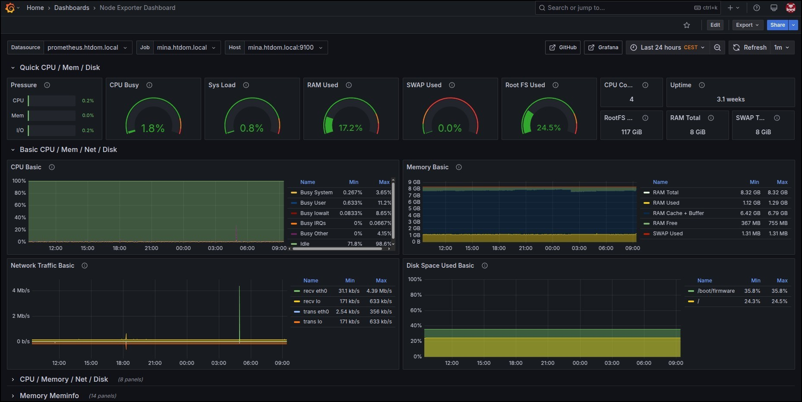
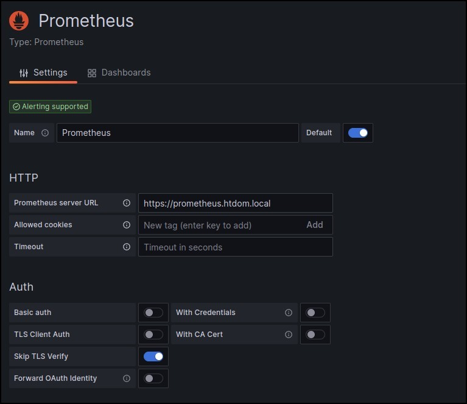

# grafana.htdom.local 

In dieser Note werden nur die Configs hinzugefügt, die derzeit auf dem Raspberry Pi laufen. 

> https://grafana.htdom.local

<a href="images/grafana_dashboard.jpg" target="_blank"></a>

---
#### Inhaltsverzeichnis

* [Ordner-Struktur](#ordner-struktur---top-of-page)
	* [~/docker/grafana/config/grafana.ini](#dockergrafanaconfiggrafanaini---top-of-page)
	* [~/docker/docker-compose.yaml](#dockerdocker-composeyaml---top-of-page)
	* [~/docker/caddy/config/Caddyfile](#dockercaddyconfigcaddyfile---top-of-page)
* [Grafana Data Sources konfigurieren](#grafana-data-sources-konfigurieren---top-of-page)
* [Grafana mit TLS absichern (Beispielkonfiguration)](#grafana-mit-tls-absichern-beispielkonfiguration---top-of-page)
* [Grafana als Service einrichten (Beispielkonfiguration)](#grafana-als-service-einrichten-beispielkonfiguration---top-of-page)
---

#### Ordner-Struktur - [Top of Page](#inhaltsverzeichnis)
```bash
sudo vi /etc/hosts
# <Docker-Host IP-Adresse> grafana.htdom.local

mkdir -p ~/docker/grafana/config
mkdir -p /opt/grafana/data
```

#### ~/docker/grafana/config/grafana.ini - [Top of Page](#inhaltsverzeichnis)
```html
[server]
  protocol = http
  http_port = 3001
  domain = htdom.local
  root_url = https://grafana.htdom.local

[users]
viewers_can_edit = true ;Allow users to see the Explore Tab (Logs)

[analytics]
  check_for_updates = true

[auth]
  disable_login_form = false
  oauth_auto_login = false
  login_cookie_name = grafana_session
  oauth_state_cookie_max_age = 60
  enable_login_token = true
  oauth_allow_insecure_email_lookup=true

[security]
  cookie_secure = true
  cookie_samesite = lax

[auth.basic]
  enabled = false

[auth.generic_oauth]
  enabled = true
  name = HTH-OIDC-OAuth
  allow_sign_up = true
  use_pkce = true
  client_id = xxx
  client_secret = xxx
  scopes = openid email profile groups
  email_attribute_path = email
  login_attribute_path = preferred_username
  name_attribute_path = name
  auth_url = https://oidc.htdom.local/authorize
  token_url = https://oidc.htdom.local/api/oidc/token
  api_url = https://oidc.htdom.local/api/oidc/userinfo
  tls_skip_verify_insecure = true
  skip_org_role_sync = false
  allow_assign_grafana_admin = true
  role_attribute_strict = true
  role_attribute_path = contains(groups[*], 'grafana-admin') && 'Admin' || contains(groups[*], 'grafana-editor') && 'Editor' || 'Viewer'

[log]
  mode = console file
  level = error

[log.console]
  level = error
  format = console

[log.file]
  level = error
  format = text
  log_rotate = true
  max_lines = 1000000
  max_size_shift = 28
  daily_rotate = true
  max_days = 7
```

#### ~/docker/docker-compose.yaml - [Top of Page](#inhaltsverzeichnis)
```yaml
  grafana:
    image: docker.io/grafana/grafana:11.6.0
    container_name: grafana
    hostname: grafana.${FQDN}
    network_mode: "host"
    user: root
    restart: always
    volumes:
      - "./grafana/config:/etc/grafana"
      - "/opt/grafana/data:/var/lib/grafana"
    ports:
      - 3001:3001
```

#### ~/docker/caddy/config/Caddyfile - [Top of Page](#inhaltsverzeichnis)
```html
grafana.htdom.local {
  reverse_proxy http://grafana.htdom.local:3001
  tls internal
}
```

#### Grafana Data Sources konfigurieren - [Top of Page](#inhaltsverzeichnis)
Home -> Connections -> Data sources -> Add new data source -> Prometheus
https://grafana.htdom.local/connections/datasources

<a href="images/grafana.png" target="_blank"></a>

#### Grafana mit TLS absichern (Beispielkonfiguration) - [Top of Page](#inhaltsverzeichnis)
```bash
sudo mkdir -p /etc/grafana/conf
sudo mkdir -p /etc/grafana/certs

sudo openssl req -x509 -newkey rsa:4096 -nodes -keyout /etc/grafana/certs/grafana.htdom.local.key -out /etc/grafana/certs/grafana.htdom.local

docker volume create --driver local -o o=bind -o type=none -o device="/etc/grafana/certs" grafana-cert
docker volume create --driver local -o o=bind -o type=none -o device="/etc/grafana/conf" grafana-data

# ---

sudo vi /etc/grafana/conf/grafana.ini

[server]
protocol = https
http_port = 3000
enforce_domain = false
root_url = https://grafana.htdom.local
cert_file = /etc/grafana/certs/grafana.htdom.local.crt
cert_key = /etc/grafana/certs/grafana.htdom.local.key

# ---

docker stop grafana
docker rm grafana

VERSION="$(curl --silent -qI https://github.com/grafana/grafana/releases/latest | awk -F '/' '/^location/ {print  substr($NF, 1, length($NF)-1)}')"
# ${VERSION} = v10.3.3
# ${VERSION#v} = 10.3.3

docker run --detach \
  --hostname grafana \
  --user 0 \
  --network="host" \
  --name grafana \
  --restart=always \
  --volume grafana-data:/var/lib/grafana \
  --volume grafana-cert:/etc/certs \
  --volume /mnt/grafana/conf/grafana.ini:/etc/grafana/grafana.ini \
  grafana/grafana:${VERSION#v}
```

#### Grafana als Service einrichten (Beispielkonfiguration) - [Top of Page](#inhaltsverzeichnis)
```bash
sudo vi /etc/systemd/system/grafana.service
# ---

[Unit]
Description=Grafana Docker Container
After=docker.service
Requires=docker.service

[Service]
TimeoutStartSec=60
Restart=always

ExecStartPre=-/usr/bin/docker stop grafana
ExecStartPre=-/usr/bin/docker rm grafana

ExecStart=/usr/bin/docker run --rm --init \
  --hostname grafana \
  --publish 3000:3000 \
  --network="host" \
  --user 0 \
  --name grafana \
  --volume grafana-data:/var/lib/grafana \
  --volume grafana-cert:/etc/certs \
  --volume /etc/grafana/conf/grafana.ini:/etc/grafana/grafana.ini \
  docker.io/grafana/grafana:10.3.3

ExecStop=-/usr/bin/docker stop grafana

[Install]
WantedBy=multi-user.target
```

Um sich an Grafana über OpenID Connect und Passkey anmelden zu können, wurde ein einfacher OIDC Provider "Pocket-ID [[oidc.htdom.local]]" installiert.
