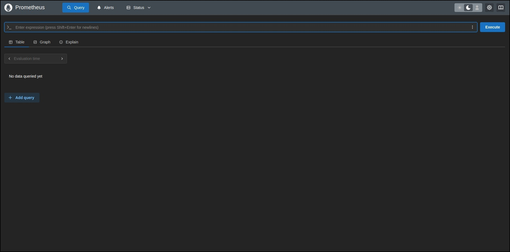

# prometheus.htdom.local

Hier wird kurz erklärt wie man einen eigene Prometheus Server mit Node-Exporter bereitstellt.

> https://prometheus.htdom.local

<a href="images/prometheus.jpg" target="_blank"></a>

---
#### Inhaltsverzeichnis

* [Prometheus Verzeichnis Struktur](#prometheus-verzeichnis-struktur---top-of-page)
* [Default Abfrage in Prometheus](#default-abfrage-in-prometheus---top-of-page)
* [Prometheus API](#prometheus-api---top-of-page)
* [Prometheus mit Basic Authentifizierung einrichten (Optional)](#prometheus-mit-basic-authentifizierung-einrichten-optional---top-of-page)
* [Prometheus Konfiguration Online aktualisieren](#prometheus-konfiguration-online-aktualisieren---top-of-page)
* [Ordner-Struktur](#ordner-struktur---top-of-page)
	* [~/docker/prometheus/config/prometheus.yaml](#dockerprometheusconfigprometheusyaml---top-of-page)
	* [~/docker/docker-compose.yaml](#dockerdocker-composeyaml---top-of-page)
	* [~/docker/caddy/config/Caddyfile](#dockercaddyconfigcaddyfile---top-of-page)
* [Node Exporter installieren und mit einem Self Sign Zertifikat absichern](#node-exporter-installieren-und-mit-einem-self-sign-zertifikat-absichern---top-of-page)
	* [~/docker/prometheus/node-exporter/config/cert.sh](#dockerprometheusnode-exporterconfigcertsh---top-of-page)
	* [~/docker/prometheus/node-exporter/config/config.yaml](#dockerprometheusnode-exporterconfigconfigyaml---top-of-page)
	* [/etc/systemd/system/node_exporter.service](#etcsystemdsystemnode_exporterservice---top-of-page)
---

#### Prometheus Verzeichnis Struktur - [Top of Page](#inhaltsverzeichnis)
```bash
/prometheus/metrics
├── 01HKMCDPDFJXZ3GPE7J0HJGQXK # Is a Data Block - ULID - like UUID but lexicographically sortable and encoding the creation time
│   ├── chunks                 # Contains the raw chunks of data points for various series - No long a single file per series
│   │   └── 000001
│   ├── index                  # index of data - lots of black magic find the data by labels
│   ├── meta.json              # readable meta data - the state of our storage and the data it contains
│   └── tombstones             # deleted data will be recorded into this file, instead removing from chunk file
├── chunks_head                # in memory data
│   ├── 000001
│   └── 000002
├── lock
├── queries.active
└── wal                        # Write-Ahead Log - The WAL segements would be truncated to "checkpoint.X" directory
    ├── 00000004
    ├── 00000005
    ├── 00000006
    ├── 00000007
    └── checkpoint.00000003
        └── 00000000

Hinweis:
 - Die Daten werden alle 2 Stunden auf der Festplatte gespeichert.
 - WAL wird zur Datenwiederherstellung verwendet.
 - 2-Stunden-Block könnte die Datenabfrage effizienter machen.

# Universally Unique Lexicographically Sortable Identifier (ULID)
ULID, or Universally Unique Lexicographically Sortable Identifier, tries to strike a balance. 
The first part of a ULID is a timestamp, the second part is random. 
This makes them sortable like auto-increment IDs, but still unique like UUIDs.
```

#### Default Abfrage in Prometheus - [Top of Page](#inhaltsverzeichnis)
```bash
## https://prometheus.io/docs/prometheus/latest/querying/examples/
## https://promlabs.com/promql-cheat-sheet/

## CPU Usage
sum by (cpu)(node_cpu_seconds_total{mode!="idle"})
sum by (cpu)(rate(node_cpu_seconds_total{mode!="idle"}[5m]))*100

## Memory Usage
node_memory_Active_bytes/node_memory_MemTotal_bytes*100

## Beispiele
node_cpu_seconds_total
node_cpu_seconds_total{mode="idle"}
node_cpu_seconds_total{mode!="idle"}
node_cpu_seconds_total{mode="idle",instance="mina.htdom.local:9100"}
node_cpu_seconds_total{mode=~"idle|user"}
node_cpu_seconds_total{mode!~"idle|user"}
node_cpu_seconds_total{mode=~".*wa.*"}
node_cpu_seconds_total{mode!~".*wa.*"}
node_cpu_seconds_total[1m]
rate(node_cpu_seconds_total[1m])
node_cpu_seconds_total offset 5m
node_cpu_seconds_total offset 1w
node_cpu_seconds_total
node_cpu_seconds_total @ start()
node_cpu_seconds_total @ end()

node_cpu_seconds_total{instance="mina.htdom.local:9100"}[1m] offset 30m @ start()
rate(node_filesystem_files_free{mountpoint="/",instance="mina.htdom.local:9100"}[10m])
#{device="/dev/mmcblk0p2", fstype="ext4", instance="mina.htdom.local:9100", mountpoint="/"} = 0.0017094017094017092

irate(node_filesystem_files_free{mountpoint="/",instance="mina.htdom.local:9100"}[10m])
#{device="/dev/mmcblk0p2", fstype="ext4", instance="mina.htdom.local:9100", mountpoint="/"} = 0

increase(node_filesystem_files_free{mountpoint="/",instance="mina.htdom.local:9100"}[10m])
#{device="/dev/mmcblk0p2", fstype="ext4", instance="mina.htdom.local:9100", mountpoint="/"} = 15180987.69230769
```

#### Prometheus API - [Top of Page](#inhaltsverzeichnis)
```bash
# https://prometheus.io/docs/prometheus/latest/querying/api/
curl -ik -u prometheus 'https://prometheus.htdom.local/api/v1/targets'
curl -ik -u prometheus 'https://prometheus.htdom.local/api/v1/label/__name__/values | jq -r '.data[]' | sort

curl -s 'https://prometheus.htdom.local/api/v1/status/runtimeinfo' | jq -r '.'
curl -s 'https://prometheus.htdom.local/api/v1/labels' | jq -r '.'
curl -s 'https://prometheus.htdom.local/api/v1/label/hostname/values' | jq -r '.data[]'
```

#### Prometheus mit Basic Authentifizierung einrichten (Optional) - [Top of Page](#inhaltsverzeichnis)
```bash
sudo apt install python3-bcrypt
vi ~/bin/gen-pass.py
```

```python
import getpass
import bcrypt

password = getpass.getpass("password: ")
hashed_password = bcrypt.hashpw(password.encode("utf-8"), bcrypt.gensalt())
print(hashed_password.decode())
```

```bash
python3 ~/bin/gen-pass.py (MySecurePwd!2024)
$2b$12$SutstHiLkBNu0l98cYSVYerWZyx2mcsSMkK7zKYkGPYGmX9U/l8VW

# ---

sudo vi ~/docker/prometheus/config/web_config.yaml

basic_auth_users:
  prometheus: $2b$12$SutstHiLkBNu0l98cYSVYerWZyx2mcsSMkK7zKYkGPYGmX9U/l8VW
  user2: $2b$12$SutstH..............
  user3: $3b$87$uHwrtB..............
  
# ---

## Diese nachfolgenden Tools funktionierten nur, wenn man Prometheus lokal als Binary installiert hat oder sich in den Docker Container verbindet.
docker exec -it prometheus /bin/sh

promtool check web-config /etc/prometheus/web_config.yaml                                                         
# /etc/prometheus/web_config.yaml SUCCESS

# ---

sudo vi ~/docker/prometheus/config/prometheus.yaml

## Prometheus Server Config
scrape_configs:
  - job_name: prometheus.domain.local
    scheme: https
    tls_config:
      insecure_skip_verify: true
    static_configs:
      - targets: ['prometheus.domain.local:443']
    basic_auth:
      username: 'prometheus'
      password: 'MySecurePwd!2024' # Passwort muss im Klartext drinstehen oder man gibt ein Passwortfile mit. Prometheus unterstützt derzeit nichts anderes. 
                                   # Man kann einen nginx als Reverse Proxy vor den prometheus Server schalten der die Authentifizierung übernimmt.
  # basic_auth:  
    # username: 'prometheus'  
    # password_file: '/etc/prometheus/.htpasswd'
                                
# ---

# sudo apt install yamllint -y

# yamllint --strict ~/docker/prometheus/config/prometheus.yaml
#   2:1       warning  missing document start "---"  (document-start)
#   12:1      error    wrong indentation: expected 2 but found 0  (indentation)
#   67:7      error    wrong indentation: expected 8 but found 6  (indentation)
#   74:25     error    trailing spaces  (trailing-spaces)
#   82:1      error    too many blank lines (1 > 0)  (empty-lines)

sudo systemctl daemon-reload
sudo systemctl restart prometheus.service

curl -sk https://prometheus.htdom.local/metrics
# Unauthorized

curl -sk -u prometheus https://prometheus.htdom.local/metrics
# Enter host password for user 'prometheus':
```

#### Prometheus Konfiguration Online aktualisieren - [Top of Page](#inhaltsverzeichnis)
```bash
# vi ~/docker/docker-compose.yaml
# --web.enable-lifecycle

curl -X POST https://prometheus.htdom.local/-/reload
```

#### Ordner-Struktur - [Top of Page](#inhaltsverzeichnis)
```bash
sudo vi /etc/hosts
# <Docker-Host IP-Adresse> prometheus.htdom.local

mkdir -p ~/docker/prometheus/config
mkdir -p /opt/prometheus/data
mkdir -p ~/docker/prometheus/node-exporter/config
```

#### ~/docker/prometheus/config/prometheus.yaml - [Top of Page](#inhaltsverzeichnis)
```yaml
---
## Global Prometheus Server Config
global:
  scrape_interval: 15s
  evaluation_interval: 60s

## Rules and alerts are read from the specified file(s)
rule_files:
  - /etc/prometheus/rules/*.yaml

## Prometheus Server Config
scrape_configs:
- job_name: 'prometheus.htdom.local'
  scheme: https
  tls_config:
    insecure_skip_verify: true
  static_configs:
    - targets: ['prometheus.htdom.local']

- job_name: 'grafana.htdom.local'
  scheme: https
  tls_config:
    insecure_skip_verify: true
  static_configs:
    - targets: ["grafana.htdom.local"]

- job_name: 'loki.htdom.local'
  scheme: https
  tls_config:
    insecure_skip_verify: true
  static_configs:
    - targets: ["loki.htdom.local"]

- job_name: 'mina.htdom.local'
  scheme: https
  tls_config:
    insecure_skip_verify: true
  static_configs:
    - targets: ["mina.htdom.local:9100"]

- job_name: 'htdom-node-exporter'
  scheme: https
  tls_config:
    insecure_skip_verify: true
  static_configs:
    - targets: ["htdom.dyndns.org:9100"]

- job_name: 'htdom-apache-exporter'
  scheme: https
  tls_config:
    insecure_skip_verify: true
  static_configs:
    - targets: ["htdom.dyndns.org:9101"]

- job_name: 'blackbox.htdom.local'
  scheme: https
  tls_config:
    insecure_skip_verify: true
  static_configs:
    - targets: ['blackbox.htdom.local']

- job_name: 'blackbox-http-check'
  metrics_path: /probe
  params:
    module: [http_2xx]
  static_configs:
    - targets:
      - https://git.htdom.local
      - https://prometheus.htdom.local
      - https://loki.htdom.local/ready
      - https://blackbox.htdom.local
      - https://registry.htdom.local/v2/_catalog
  relabel_configs:
    - source_labels: [__address__]
      target_label: __param_target
    - source_labels: [__param_target]
      target_label: instance
    - target_label: __address__
      replacement: blackbox.htdom.local:9115
```

#### ~/docker/docker-compose.yaml - [Top of Page](#inhaltsverzeichnis)
```yaml
  prometheus:
    image: docker.io/prom/prometheus:v3.2.1
    container_name: prometheus
    hostname: prometheus.${FQDN}
    network_mode: "host"
    user: root
    restart: always
    volumes:
      - "./prometheus/config:/etc/prometheus"
      - "/opt/prometheus/data:/prometheus"
    command:
      - '--web.page-title=Prometheus Monitoring'
      - '--storage.tsdb.path=/prometheus'
      - '--storage.tsdb.retention.time=30d'
      - '--config.file=/etc/prometheus/prometheus.yaml'
      - '--web.config.file=/etc/prometheus/web_config.yaml'
      - '--web.console.libraries=/usr/share/prometheus/console_libraries'
      - '--web.console.templates=/usr/share/prometheus/consoles'
      - '--web.external-url=https://prometheus.htdom.local'
      - '--web.enable-lifecycle'
      - '--web.enable-admin-api'
    ports:
      - 9090:9090
```

#### ~/docker/caddy/config/Caddyfile - [Top of Page](#inhaltsverzeichnis)
```html
prometheus.htdom.local {
  reverse_proxy http://prometheus.htdom.local:9090
  tls internal
}
```

#### Node Exporter installieren und mit einem Self Sign Zertifikat absichern - [Top of Page](#inhaltsverzeichnis)
```bash
sudo groupadd node_exporter
sudo useradd --system --gid node_exporter --shell /bin/false --comment "Node Exporter Service User" node_exporter

sudo mkdir /etc/node_exporter
sudo chmod 0755 /etc/node_exporter
sudo chown -R root:node_exporter /etc/node_exporter

sudo mkdir /var/lib/node_exporter
sudo chown -R node_exporter:node_exporter /var/lib/node_exporter

cd /tmp
VERSION="$(curl --silent -qI https://github.com/prometheus/node_exporter/releases/latest | awk -F '/' '/^location/ {print  substr($NF, 1, length($NF)-1)}')"
# ${VERSION} = v1.7.0
# ${VERSION#v} = 1.7.0

## ARM64
sudo wget "https://github.com/prometheus/node_exporter/releases/download/${VERSION}/node_exporter-${VERSION#v}.linux-arm64.tar.gz"
sudo tar xvfz node_exporter-${VERSION#v}.linux-arm64.tar.gz
sudo mv node_exporter-${VERSION#v}.linux-arm64/node_exporter /usr/local/bin/
sudo rm -r node_exporter-${VERSION#v}.linux-arm64 node_exporter-${VERSION#v}.linux-arm64.tar.gz

# ---

# Zusätzliche Services an Prometheus übergeben
sudo vi /etc/default/node_exporter

NODE_EXPORTER_OPTS="--collector.systemd --collector.systemd.unit-whitelist="(gitea).service""
# oder
NODE_EXPORTER_OPTS="--collector.systemd --collector.systemd.unit-whitelist="(gitea|apache2|usw).service""
```

#### ~/docker/prometheus/node-exporter/config/cert.sh - [Top of Page](#inhaltsverzeichnis)
```bash
#!/usr/bin/env bash
set -ex

CONFIG_PATH="/etc/node_exporter"
CERT_FQDN="$(hostname --fqdn)"

openssl req -new -newkey rsa:2048 -days 365 -nodes -x509 \
  -keyout "${CONFIG_PATH}/${CERT_FQDN}.key" \
  -out "${CONFIG_PATH}/${CERT_FQDN}.crt" \
  -subj "/C=DE/ST=Bayern/L=Muenchen/O=HTH Inc./CN=${CERT_FQDN}" \
  -addext "subjectAltName = DNS:${CERT_FQDN}"

tee -a "${CONFIG_PATH}/config.yaml" <<EOF >/dev/null
tls_server_config:
  cert_file: /etc/node_exporter/${CERT_FQDN}.crt
  key_file: /etc/node_exporter/${CERT_FQDN}.key

EOF

chown -R node_exporter:node_exporter "${CONFIG_PATH}"
chmod 0750 "${CONFIG_PATH}"
```

#### ~/docker/prometheus/node-exporter/config/config.yaml - [Top of Page](#inhaltsverzeichnis)
```yaml
# Diese Config wird aus dem oberen Bash Skript erstellt
tls_server_config:
  cert_file: /etc/node_exporter/mina.htdom.local.crt
  key_file: /etc/node_exporter/mina.htdom.local.key
```

#### /etc/systemd/system/node_exporter.service - [Top of Page](#inhaltsverzeichnis)
```bash
[Unit]
Description=Prometheus Node Exporter
After=network-online.target

[Service]
Type=simple
User=node_exporter
Group=node_exporter
ExecStart=/usr/local/bin/node_exporter \
  --web.config.file="/etc/node_exporter/config.yaml" \
  --collector.systemd \
  --collector.textfile \
  --collector.textfile.directory=/var/lib/node_exporter \
  --web.listen-address=0.0.0.0:9100 \
  --web.telemetry-path=/metrics \
  --web.disable-exporter-metrics

Restart=always
RestartSec=1
StartLimitInterval=0

ProtectHome=yes
NoNewPrivileges=yes

ProtectSystem=strict
ProtectControlGroups=true
ProtectKernelModules=true
ProtectKernelTunables=yes

[Install]
WantedBy=multi-user.target
```
